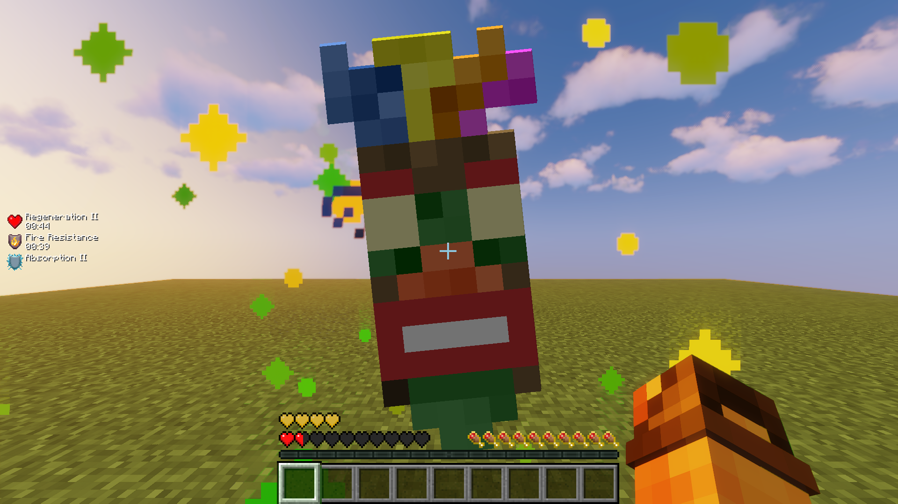
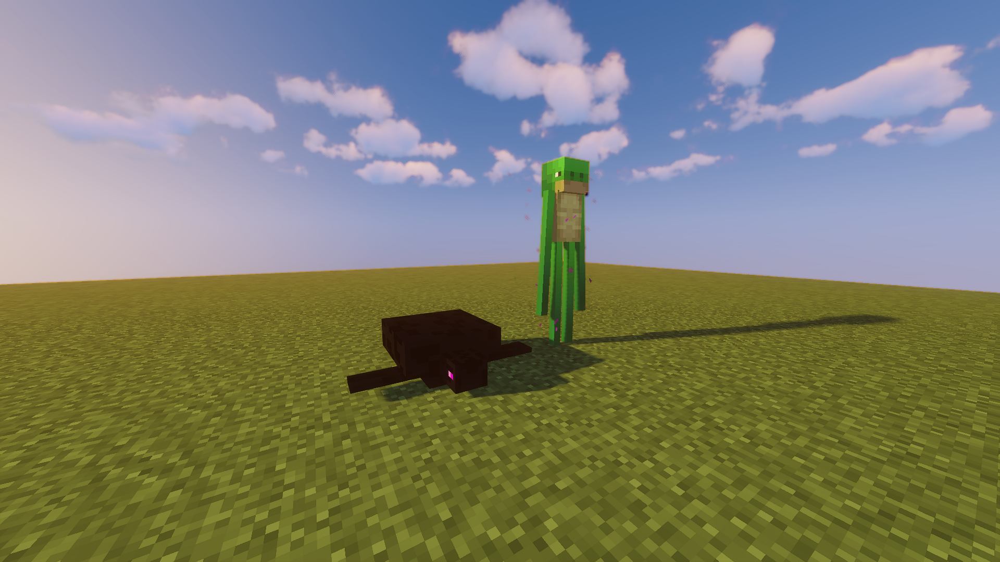
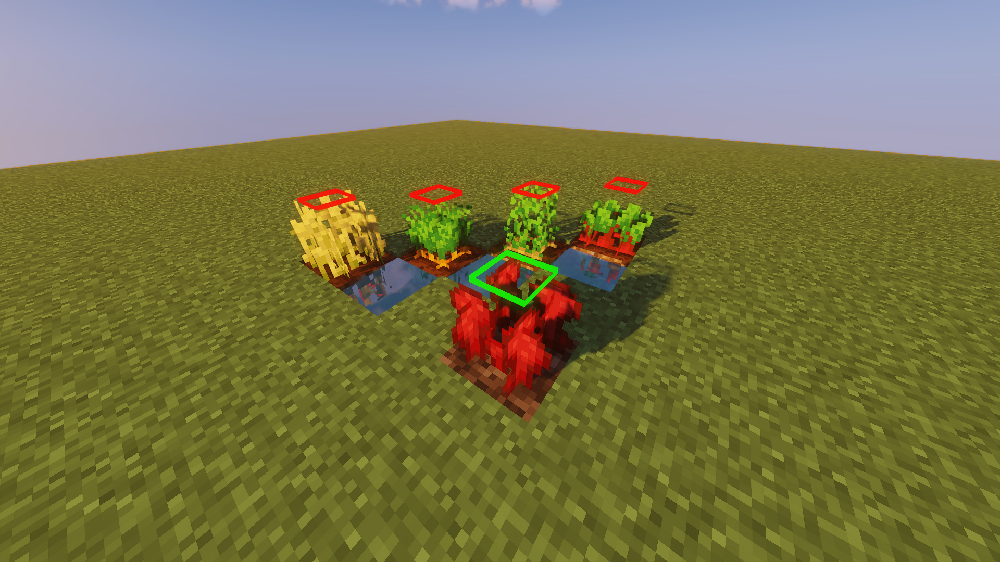
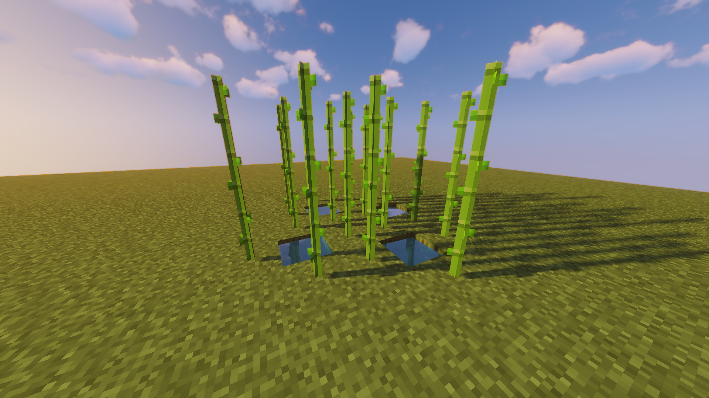
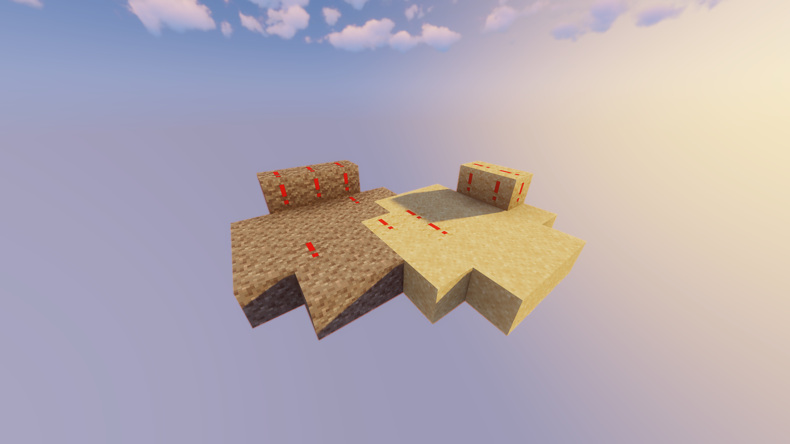

# Minecraft Resource Packs
These are Resource Packs that I use/used in Minecraft  

# My Texture Packs
Texture Packs that I created. Don't expect much :)

| Name | Description | Preview | Download |
| - | - | - | :-: |
| All | All packs combined | - | [Download All](https://github.com/yungcypo/Minecraft/releases/download/1.21/CypoPack-All.zip) |
| AkuAkuTotem | Replaces texture of *Totem Of Undying* with [*AkuAku*](https://crashbandicoot.fandom.com/wiki/Aku_Aku) |  | [Download All](https://github.com/yungcypo/Minecraft/releases/download/1.21/CypoPack-AkuAkuTotem.zip) |
| AmogusTotem | Replaces texture of *Totem of Undying* with *Among Us* character |  | [Download AmogusTotem](https://github.com/yungcypo/Minecraft/releases/download/1.21/CypoPack-AmogusTotem.zip) |
| EnderTurtle | Switches texture of *Enderman* and *Turtle* |  | [Download EnderTurtle](https://github.com/yungcypo/Minecraft/releases/download/1.21/CypoPack-EnderTurtle.zip) |
| Plants | Adds colored highlight to the top of full-grown plants, making them easier to spot |  | [Download PlantsCypoPack-Plants/pack.png](https://github.com/yungcypo/Minecraft/releases/download/1.21/CypoPack-Plants.zip) |
| Sugarcane | Makes sugarcane less dense, making it easier to see dropped sugarcane while harvesting |  | [Download Sugarcane](https://github.com/yungcypo/Minecraft/releases/download/1.21/CypoPack-Sugarcane.zip) |
| Unsuspicious | Adds a big exclamation mark (!) to *Suspicious Sand* and *Suspicious Gravel*, making it a lot easier to see |  | [Download Unsuspicious](https://github.com/yungcypo/Minecraft/releases/download/1.21/CypoPack-Unsuspicious.zip) |

## Usage
1. Download desired Texture Pack from [Releases page](https://github.com/yungcypo/Minecraft/releases/latest)
2. Move downloaded Texture Pack to Minecraft's *resourcepacks* folder
    - On Windows - `%appdata%/.minecraft/resourcepacks`
    - On Linux - `~/.minecraft/resourcepacks`
3. In Minecraft settings, go to *Resource Packs* tab and enable your new Texture Pack
4. Enjoy!
