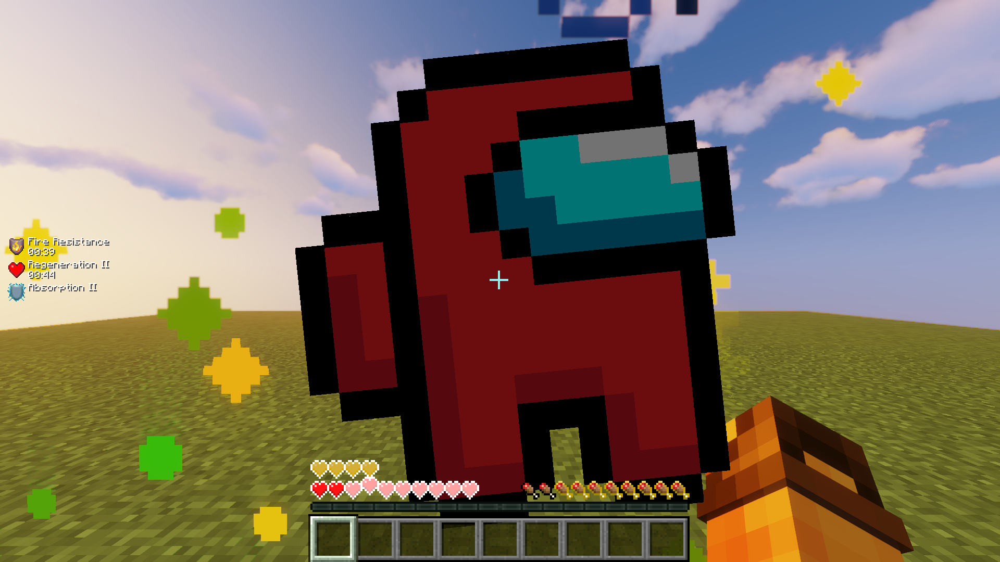

# Minecraft Resource Packs
These are Resource Packs that I use/used in Minecraft  

# My Texture Packs
Texture Packs that I created. Don't expect much :)

| Name | Description | Preview |
| - | - | - |
| All | All packs combined | - |
| AkuAkuTotem | Replaces texture of *Totem Of Undying* with [*AkuAku*](https://crashbandicoot.fandom.com/wiki/Aku_Aku) |  |
| AmogusTotem | Replaces texture of *Totem of Undying* with *Among Us* character |  |
| EnderTurtle | Switches texture of *Enderman* and *Turtle* |  |
| Plants | Adds colored highlight to the top of full-grown plants, making them easier to spot |  |
| Sugarcane | Makes sugarcane less dense, making it easier to see dropped sugarcane while harvesting |  |
| Unsuspicious | Adds a big exclamation mark (!) to *Suspicious Sand* and *Suspicious Gravel*, making it a lot easier to see |  |

## Usage
1. Download desired Texture Pack from [Releases page](https://github.com/yungcypo/Minecraft/releases/latest)
2. Move downloaded Texture Pack to Minecraft's *resourcepacks* folder
    - On Windows - `%appdata%/.minecraft/resourcepacks`
    - On Linux - `~/.minecraft/resourcepacks`
3. In Minecraft settings, go to *Resource Packs* tab and enable your new Texture Pack
4. Enjoy!
