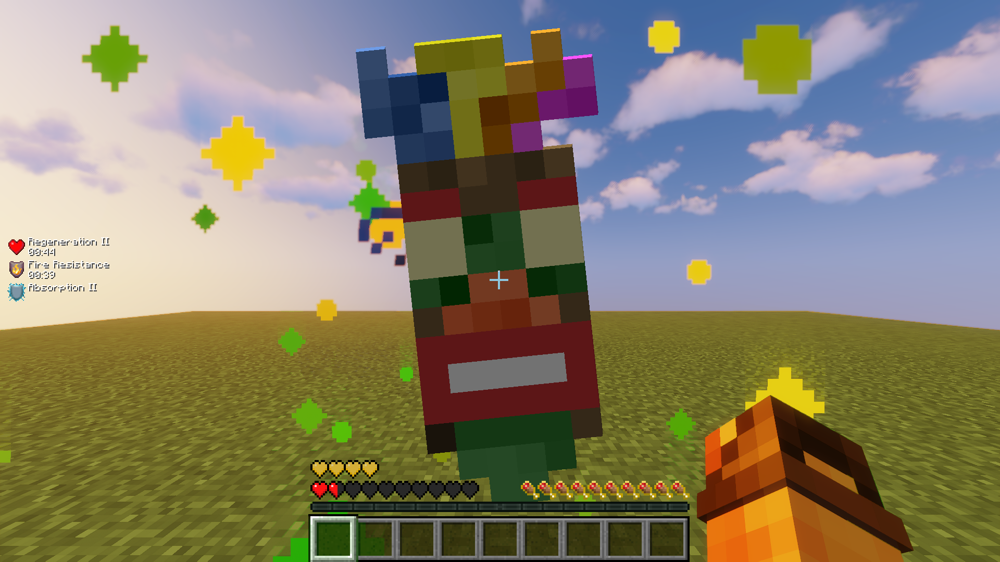
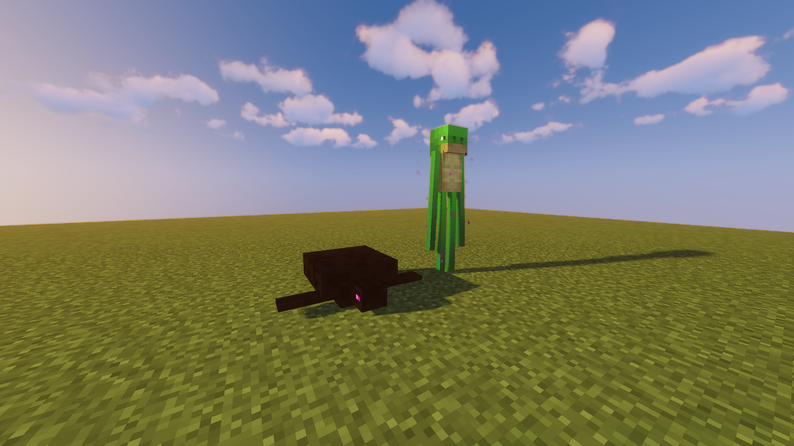
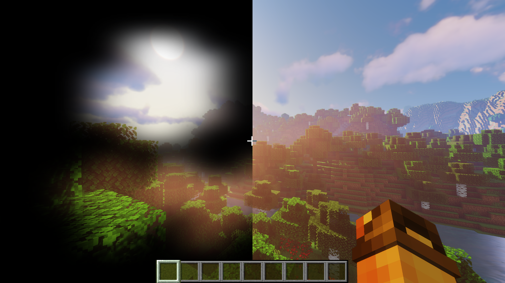
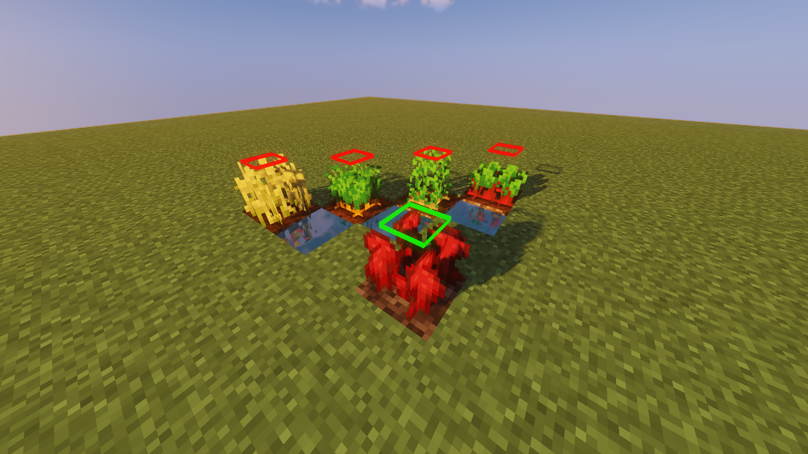
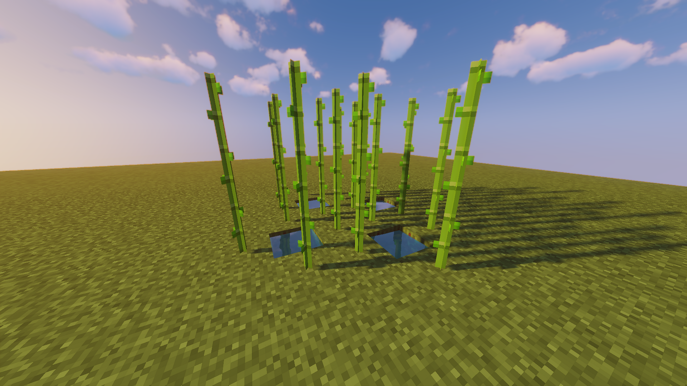
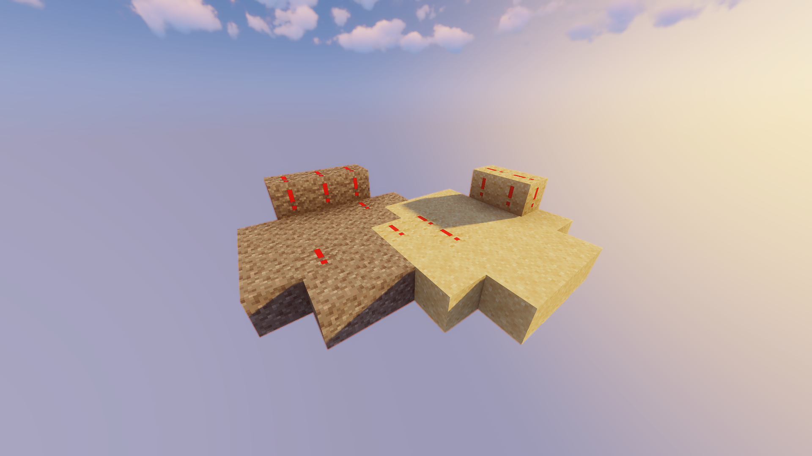

| Name | Description | Preview | Download |
| --- | --- | --- | --- |
| All |  All packs combined | - | [Download All](https://github.com/cyprich/Minecraft/releases/download/v1.1.0/CypoPack-All.zip) |
| AkuAkuTotem |  Replaces texture of *Totem Of Undying* with [*AkuAku*](https://crashbandicoot.fandom.com/wiki/Aku_Aku) |  | [Download AkuAkuTotem](https://github.com/cyprich/Minecraft/releases/download/v1.1.0/CypoPack-AkuAkuTotem.zip) |
| AmogusTotem |  Replaces texture of *Totem of Undying* with *Among Us* character |  | [Download AmogusTotem](https://github.com/cyprich/Minecraft/releases/download/v1.1.0/CypoPack-AmogusTotem.zip) |
| ClearScaffolding |  Removes center of *Scaffolding*, making it easier to see while climbing |  | [Download ClearScaffolding](https://github.com/cyprich/Minecraft/releases/download/v1.1.0/CypoPack-ClearScaffolding.zip) |
| EnderTurtle |  Switches texture of *Enderman* and *Turtle* |  | [Download EnderTurtle](https://github.com/cyprich/Minecraft/releases/download/v1.1.0/CypoPack-EnderTurtle.zip) |
| NoPumpkinBlur |  Removes annoying overlay while wearing *Pumpkin* |  | [Download NoPumpkinBlur](https://github.com/cyprich/Minecraft/releases/download/v1.1.0/CypoPack-NoPumpkinBlur.zip) |
| Plants |  Adds colored highlight to the top of full-grown plants, making them easier to spot |  | [Download Plants](https://github.com/cyprich/Minecraft/releases/download/v1.1.0/CypoPack-Plants.zip) |
| Sugarcane |  Makes sugarcane less dense, making it easier to see dropped sugarcane while harvesting |  | [Download Sugarcane](https://github.com/cyprich/Minecraft/releases/download/v1.1.0/CypoPack-Sugarcane.zip) |
| Unsuspicious |  Adds a big exclamation mark (!) to *Suspicious Sand* and *Suspicious Gravel*, making it a lot easier to see |  | [Download Unsuspicious](https://github.com/cyprich/Minecraft/releases/download/v1.1.0/CypoPack-Unsuspicious.zip) |
